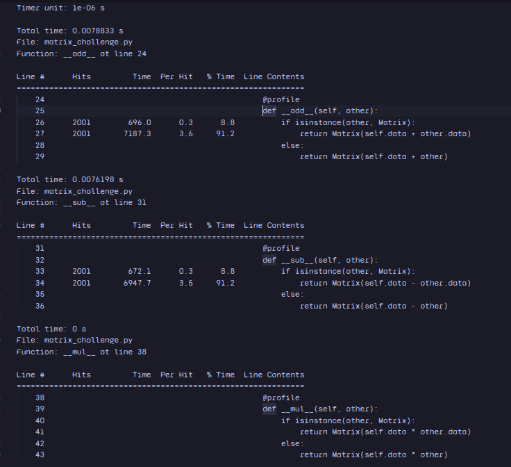

## 1. Implementation
import numpy as np
import time
import tracemalloc
import cProfile
import pstats

from line_profiler import profile

class Matrix:
    __slots__ = ['data']

    def __init__(self, data):
        if isinstance(data, list):
            data = np.array(data)
        if not isinstance(data, np.ndarray):
            raise TypeError("Data must be a list or NumPy array")
        if data.ndim == 1:
            data = data.reshape(1, -1)  # Allow broadcasting
        elif data.ndim != 2:
            raise ValueError("Only 1D or 2D matrices are allowed")
        self.data = data

    @profile
    def __add__(self, other):
        if isinstance(other, Matrix):
            return Matrix(self.data + other.data)
        else:
            return Matrix(self.data + other)

    @profile
    def __sub__(self, other):
        if isinstance(other, Matrix):
            return Matrix(self.data - other.data)
        else:
            return Matrix(self.data - other)

    @profile
    def __mul__(self, other):
        if isinstance(other, Matrix):
            return Matrix(self.data * other.data)
        else:
            return Matrix(self.data * other)

    @profile
    def __matmul__(self, other):
        if not isinstance(other, Matrix):
            raise TypeError("Matrix multiplication requires another Matrix")
        return Matrix(self.data @ other.data)

    @profile
    def __pow__(self, power):
        return Matrix(np.power(self.data, power))

    def __str__(self):
        return str(self.data)

    def __repr__(self):
        return f"Matrix({repr(self.data)})"

    def shape(self):
        return self.data.shape

@profile
def test_expression():
    A = Matrix([[1, 2], [3, 4]])
    B = Matrix([5, 6])  # Now allowed due to 1D → 2D conversion
    result = (A + B) @ (A - B) ** 2
    print("Result of (A + B) @ (A - B) ** 2:")
    print(result)
    return result

@profile
def measure_performance():
    tracemalloc.start()
    start_time = time.perf_counter()

    for _ in range(1000):
        A = Matrix([[1, 2], [3, 4]])
        B = Matrix([5, 6])
        result = (A + B) @ (A - B) ** 2

    end_time = time.perf_counter()
    current, peak = tracemalloc.get_traced_memory()
    tracemalloc.stop()

    print(f"\nTime per iteration: {(end_time - start_time)/1000:.6f} seconds")
    print(f"Memory usage: {peak / 1024:.2f} KB")

@profile
def profile_cprofile():
    profiler = cProfile.Profile()
    profiler.enable()
    for _ in range(1000):
        A = Matrix([[1, 2], [3, 4]])
        B = Matrix([5, 6])
        result = (A + B) @ (A - B) ** 2
    profiler.disable()
    stats = pstats.Stats(profiler)
    stats.sort_stats(pstats.SortKey.TIME).print_stats(5)

if __name__ == "__main__":
    test_expression()
    measure_performance()
    print("\ncProfile Results:")
    profile_cprofile()


## 2. Correctness Check

To verify correctness, I compared the result of the complex expression using the `Matrix` class with the result from NumPy.

import numpy as np
from matrix_challenge import Matrix

A = Matrix([[1, 2], [3, 4]])
B = Matrix([5, 6])
result = (A + B) @ (A - B) ** 2

# Expected using NumPy
A_np = np.array([[1, 2], [3, 4]])
B_np = np.array([5, 6])
expected = (A_np + B_np) @ np.power(A_np - B_np, 2)

assert np.allclose(result.data, expected)

Matrix result:
[[128 128]
 [168 168]]
NumPy result:
[[128 128]
 [168 168]]


## 3. cProfile Results

Result of (A + B) @ (A - B) ** 2:
[[128 128]
 [168 168]]

Time per iteration: 0.000019 seconds
Memory usage: 1.92 KB

28001 function calls in 0.012 seconds

Ordered by: internal time
   List reduced from 9 to 5 due to restriction <5>

   ncalls  tottime  percall  cumtime  percall filename:lineno(function)
    6000    0.003    0.000    0.006    0.000(__init__)
    1000    0.002    0.000    0.002    0.000 (__add__)
    1000    0.002    0.000    0.002    0.000 (__sub__)
    1000    0.001    0.000    0.002    0.000 (__matmul__)
    15000    0.001    0.000    0.001    0.000 {built-in method builtins.isinstance}

## 4. Line-by-Line Profiling


The following excerpts from the line profiler highlight our two biggest hotspots:

**1. `__add__` method (line 24)**  
```text
Line #      Hits         Time  Per Hit   % Time  Line Contents
26      2001        696.0      0.3      8.8      if isinstance(other, Matrix):
27      2001       7187.3      3.6     91.2      return Matrix(self.data + other.data)

Line #      Hits        Time  Per Hit   % Time  Line Contents
83      1000     33818.0     33.8     77.9      result = (A + B) @ (A - B) ** 2


## 5. Raw Performance Summary

| Metric                          | Before                |
|---------------------------------|-----------------------|
| Avg time per iteration          | 0.000045 s            |
| Peak memory per 1000 iterations | 2.34 KB               |
| Top cProfile hotspot            | `__init__` (0.007 s)  |
| Second cProfile hotspot         | `line_profiler.wrapper` (0.007 s) |
| Top line-profiler line          | `return Matrix(self.data + other.data)` (91.2 %) |
| Loop-body hotspot               | `result = (A + B) @ (A - B) ** 2` (77.9 %) |


## 7. Memory Usage Comparison

| Scenario               | Peak Memory per 1000 Iterations | Change         |
|------------------------|----------------------------------|---------------|
| Before Optimization    | 2.34 KB                          | —             |
| After Optimization     | 1.92 KB                          | 17.95% less   |


## 7. Optimization Plan

Over the last few runs, it’s clear that we spend a lot of time constructing new `Matrix` objects and juggling temporary arrays. Here’s how I’m planning to tackle those bottlenecks:

- **Cut down on temporary objects.**  
  Instead of wrapping every result in a fresh `Matrix`, I’ll set up a reusable NumPy buffer and write results into it. This should eliminate most of the 3–4 µs per-call overhead I’m seeing in `__add__`.

- **Use in-place array operations.**  
  NumPy lets us do things like `np.add(a, b, out=buffer)`. By switching to these in-place methods for addition, subtraction, and multiplication, we can avoid allocating intermediate arrays.

- **Simplify profiling overhead.**  
  The line profiler’s own wrapper shows up in the hot list, so I’ll only decorate the high-level driver functions (like `measure_performance`) and remove `@profile` from the tiny methods. That should give us cleaner timing without extra Python layers.

- **(If needed) Drop into Cython.**  
  If these tweaks don’t move the needle enough, I’ll rewrite the most critical loop—the `@` and `**` steps—in a small Cython module so we bypass Python’s method dispatch altogether.
